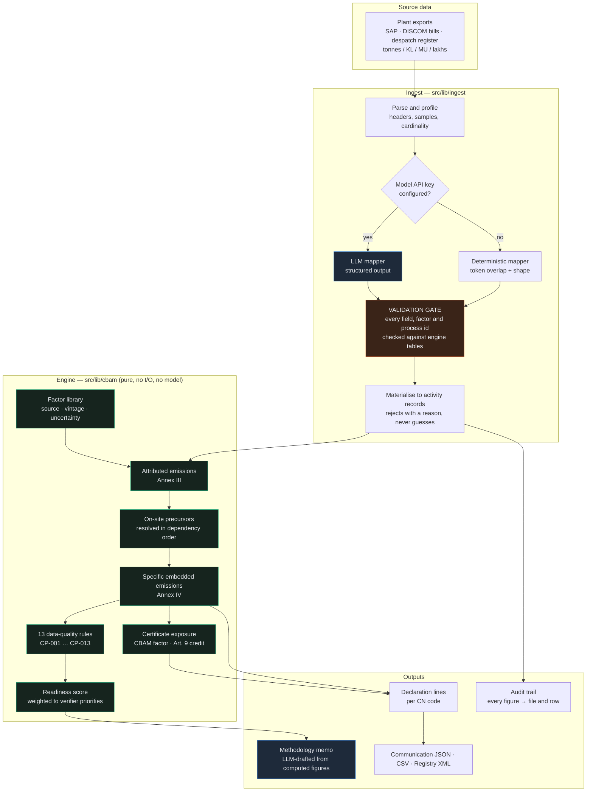

# CarbonPass AI

[](https://github.com/aquiadi/CBAM-Compilance/actions/workflows/ci.yml?query=branch%3Amain)
[](.nvmrc)
[](tsconfig.json)
[](LICENSE)

**CBAM compliance for Indian exporters. Messy production data in, a defensible emissions
declaration out.**

---

## Executive summary

From 1 January 2026 the EU's Carbon Border Adjustment Mechanism stops being a reporting exercise and
starts costing money. An Indian steel, aluminium, cement or fertiliser exporter must tell their EU
importer how much CO₂ is embedded in every tonne shipped, evidence it to an accredited verifier, and
watch that figure multiplied by an EU ETS certificate price on a schedule reaching 100% by 2034. The
data to answer that already exists — scattered across an SAP consumption extract, a DISCOM
electricity bill and a despatch register, in tonnes, kilolitres, million units and lakhs, with the
units in a different column from the numbers.

CarbonPass ingests those files and produces a declaration with every figure traceable to the source
row that produced it.

**On the seeded demo — a Chhattisgarh DRI–EAF steel plant, 5 files, 120 rows:**

| Metric                                   | Result                                                      |
| ---------------------------------------- | ----------------------------------------------------------- |
| Unit error caught                        | A coal row exported in **kg** while the UOM column said MT  |
| Phantom exposure removed                 | **€65.2M → €307,892** once the operator acts on the finding |
| Declaration readiness                    | **80 → 89 / 100**, 3 blocking findings → 0                  |
| Calculated intensity vs sector benchmark | Within **1–13%** across all three products                  |
| Mapping eval — column **error** rate     | **0.0%** across 9 adversarial cases                         |
| Test suite                               | **87 tests**, including architecture tests enforcing purity |

The product is the catch. A single misread unit was worth €64.9M of imaginary liability.

---

## Architecture

The system is two halves separated by a validation gate. A language model handles the fuzzy problem
(what does this column mean); a deterministic engine owns every number. Nothing crosses the gate
without being checked against the engine's own tables.



### The core design decision: the model never touches a number

This is a compliance tool. A wrong figure is not a bad user experience, it is a misdeclaration with
a penalty attached.

| The model does                                  | The engine does                                        |
| ----------------------------------------------- | ------------------------------------------------------ |
| Map "Qty Consumed" to a canonical field         | Convert 19,240.80 MT of coal to 18 TJ to 1,702.8 tCO₂e |
| Notice the unit column says MU, not MWh         | Apply Annex IV to get specific embedded emissions      |
| Resolve "NON COKING COAL (G11)" to a factor id  | Decide whether the declaration is filable              |
| Rank findings and explain them in plain English | Raise, keep and clear the findings themselves          |
| Draft the methodology memo                      | Own every figure in it                                 |

A hallucinated factor id is dropped and reported, never applied. A triage comment on a finding the
rules engine never raised is discarded. A blocker cannot be demoted below a warning however the
model ranked it. These are not conventions — they are enforced by
[`guardrails.test.ts`](src/lib/ai/guardrails.test.ts), which feeds deliberately bad model output
through the validators, and by [`architecture.test.ts`](src/lib/cbam/architecture.test.ts), which
fails the build if any engine file imports the AI layer, reads `process.env`, touches the network or
filesystem, or reads the clock.

**The whole product works with no API key.** Every AI step falls back to a deterministic
implementation and the UI labels which one produced each result.

---

## Quickstart

```bash
make install     # npm ci
make dev         # http://localhost:3000, demo dataset seeded on first request
make check       # lint, format, types, fixture checksums, 87 tests, mapping eval
```

`make help` lists every target. No API key is required for any of the above.

To enable the LLM path:

```bash
cp .env.example .env      # set the model API key
make eval-model           # scores the LLM mapper against the deterministic baseline
```

### Docker

```bash
make docker-build
make docker-run           # http://localhost:3000
# or: docker compose up --build
```

Multi-stage build on Next's standalone output, running as a non-root user with a healthcheck that
loads a real page — proving the engine can compute a declaration, not merely that a process is
listening.

---

## Engineering decisions & trade-offs

**A deterministic engine rather than an end-to-end model.** The obvious build is to hand the
spreadsheets to a model and ask for the emissions. That fails the only test that matters: a verifier
asks "where did 1.93 come from" and the answer has to be an arithmetic chain, not a probability. So
the model is confined to the genuinely ambiguous problem — what does this column mean — and every
figure comes from pure functions with unit tests. The cost is that the system cannot handle a file
shape nobody anticipated; it rejects rows instead, which is the right failure direction.

**Confidence is capped at 0.90 for the deterministic mapper.** Token overlap plus a shape check
cannot distinguish "certainly right" from "probably right". A mapper reporting 0.99 on a guess
defeats the review step that confidence exists to drive, so the ceiling is deliberate. Only an
operator-configured alias — a fact, not an inference — scores higher.

**The eval gates on column _error_ rate, not accuracy.** A column mapped to the wrong field corrupts
a calculation silently. A column left unmapped surfaces in the UI and is fixed in ten seconds. Those
two failures cost different amounts, so scoring them as one number would hide the one that matters.
Two eval cases are left deliberately failing: `DOLOCHAR` is spent kiln char but contains the
substring "dolo", so keyword matching confidently applies a carbonate factor to a fuel. The right
answer when nothing fits is `null`. That is the headroom the LLM mapper should win, and a saturated
eval could not measure it.

**Checksums rather than a data-versioning tool.** The dataset is five deterministically generated
CSVs totalling ~20 KB. Adding a Python data-versioning stack with a remote store to track that would
be ceremony. What actually matters is the guarantee: the figures quoted here were produced from
_these_ bytes. A SHA-256 manifest verified in CI delivers that with zero runtime dependencies.

**A JSONL eval log rather than a tracking service.** Every eval run is recorded with its commit SHA
and compared against the previous run, so "did that change help" is answerable after the fact. But
nothing here trains, so there is no loss curve to plot and no hyperparameter sweep to coordinate —
a hosted tracking server would be a dashboard with one number on it.

**Configuration is injected at the application layer, never read inside the engine.** An earlier
revision had `cost.ts` read the certificate price from the environment. That is convenient and
wrong: it makes the same activity records produce different figures on different machines. The
engine now takes explicit assumptions and the store supplies them from validated config.

**Certificates are charged on EU-bound volume, not total production.** Sponge iron made and consumed
on site already carries its emissions downstream as a precursor. Charging total production would
count the same tonne of coal three times across the DRI → billet → rebar chain.

**State is a JSON file.** Right size for a single installation, wrong shape for a multi-tenant
service. The seam is `src/lib/store.ts` and nothing else.

---

## Methodology

Calculations follow Regulation (EU) 2023/956 and Implementing Regulation (EU) 2023/1773.

- **Direct emissions** (Annex III): fuel combustion via net calorific value × combustion factor,
  plus process emissions from carbonates and electrodes, plus measurable heat imported, less
  exported.
- **Specific embedded emissions** (Annex IV):
  `(attributed emissions + Σ precursor mass × precursor SEE) ÷ activity level`.
- **On-site precursors** resolved in dependency order — sponge iron before steel, steel before
  rebar. Without this the rolling mill looks nearly emission-free, because it only burns reheating
  fuel while every real tonne of CO₂ sits two processes upstream.
- **Annex II**: for iron & steel, aluminium and hydrogen only _direct_ emissions create an
  obligation. Indirect emissions are still reported in full — operators routinely read "not counted"
  as "not reported", and it is not.
- **Carbon price paid at origin** (Art. 9): deductible, capped at the certificate price, refused
  without documentary evidence. India has no qualifying economy-wide scheme today.
- **CBAM factor**: 2.5% in 2026 rising to 100% in 2034. A tonne saved in 2026 is worth 2.5% of a
  tonne saved in 2034 — the honest answer to "should I invest in abatement now".

Factors are IPCC 2006 Vol. 2 defaults and CEA CO₂ Baseline Database grid factors, each carrying its
source, edition and uncertainty. The full library, rule catalogue and CN code list are rendered in
the app at `/methodology`.

One India-specific adjustment: coal NCV is set to 18.0 GJ/t rather than the IPCC 25.8 GJ/t default,
which assumes internationally traded bituminous coal and overstates energy input from high-ash
domestic supply by roughly 40%.

> **On the benchmark values.** The comparison figures are indicative sector benchmarks assembled
> from public literature, **not** the Commission's published default values, and the app says so
> beside every comparison and in every export. They catch an implausible number; they never
> substitute for primary data in a filed declaration.

---

## Commands

| Command             | What it does                                                   |
| ------------------- | -------------------------------------------------------------- |
| `make check`        | Everything CI runs: lint, format, types, data, tests, eval     |
| `make test`         | 87 unit and architecture tests                                 |
| `make eval`         | Mapping eval, deterministic baseline, records the run          |
| `make eval-model`   | Adds the LLM mapper column (needs an API key)                  |
| `make seed`         | Regenerate demo fixtures and refresh their checksum manifest   |
| `make data-verify`  | Fail if fixtures drift from the manifest                       |
| `make screenshots`  | Drive the running app in Chromium and capture every screen     |
| `make docker-build` | Build the container image                                      |
| `make reset`        | Discard workspace state; demo reseeds with every defect intact |

---

## Layout

```
.github/workflows/ci.yml   Lint, format, types, fixtures, tests, eval, build, smoke, image
config/                    Reserved for deployment overlays
data/demo/                 Seeded dataset + manifest.json (SHA-256 per fixture)
scripts/
  generate-fixtures.ts     Deterministic demo data generator
  fixtures.ts              Checksum manifest write/verify
  screenshot.mjs           Playwright capture of every screen
src/
  config/env.ts            Zod-validated environment; nothing else reads process.env
  lib/cbam/                THE ENGINE — pure, deterministic, no I/O, no model
    types.ts               Domain model; every quantity carries lineage to a source row
    units.ts               MU / MT / KL and Indian digit grouping; throws, never guesses
    factors.ts             Emission factors with source, vintage, uncertainty
    goods.ts               CN codes and the Annex II direct-only flag
    calc.ts                Attributed emissions and specific embedded emissions
    internal.ts            On-site precursor flows in dependency order
    cost.ts                CBAM factor schedule, certificates, Art. 9 credit
    rules.ts               13 data-quality rules
    readiness.ts           Weighted to what a verifier tests first
    declaration.ts         Assembly and JSON / CSV / Registry-XML exports
    architecture.test.ts   Fails the build if the engine stops being pure
  lib/ingest/              Messy world → canonical schema
  lib/ai/                  Model layer, entirely optional
    mapper.ts              Structured-output mapping + id validation
    triage.ts              Finding triage + the merge that contains it
    memo.ts                Streaming memo, with a deterministic twin
    guardrails.test.ts     Feeds bad model output through the validators
  evals/                   Gold fixtures, scorer, runner, JSONL run tracker
  app/                     Next.js App Router — 7 screens, 7 API routes
```

---

## Limitations, stated plainly

- **It does not file anything.** It computes and documents a declaration. Submission to the CBAM
  Registry and verification by an accredited verifier remain human steps. Not legal advice.
- **Benchmark values are indicative, not the Commission's published defaults.**
- **The Registry XML mirrors the quarterly report's structure** but is not claimed schema-valid
  against the DG TAXUD XSD, which is versioned and distributed separately.
- **The CN code catalogue is a working subset** of Annex I covering what Indian exporters ship in
  volume.
- **The LLM path is implemented and its guardrails are unit-tested, but has not been executed
  against a live API** — no credentials were available in the development environment. Every figure
  and screenshot here came from the deterministic path.
- **Shared site activities are attributed by configured alias, not allocated.** Diesel for material
  handling lands on the DRI kiln because the installation config says so; a real deployment would
  want proper allocation across processes.

---

## Licence

MIT — see [LICENSE](LICENSE).
